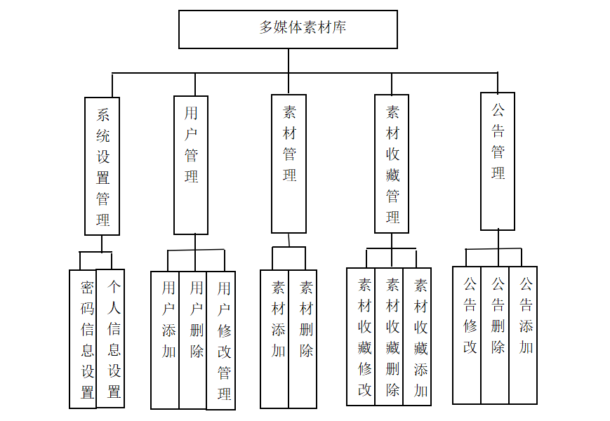
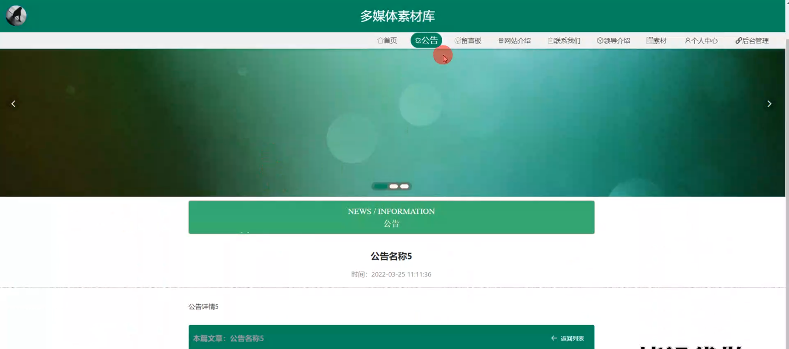
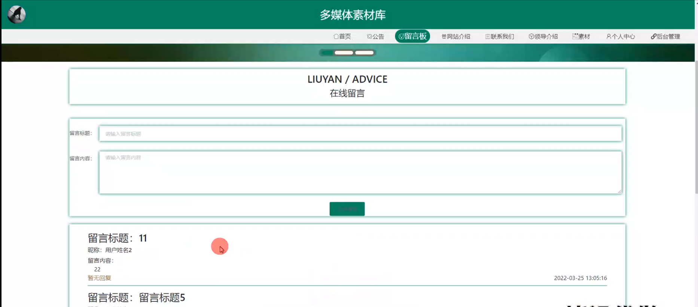
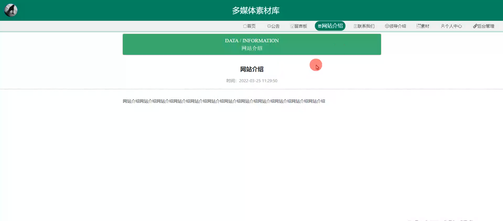
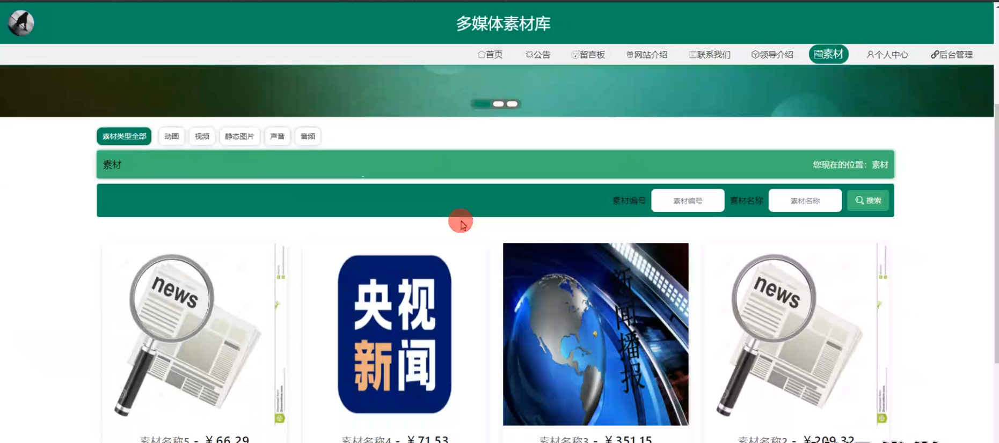
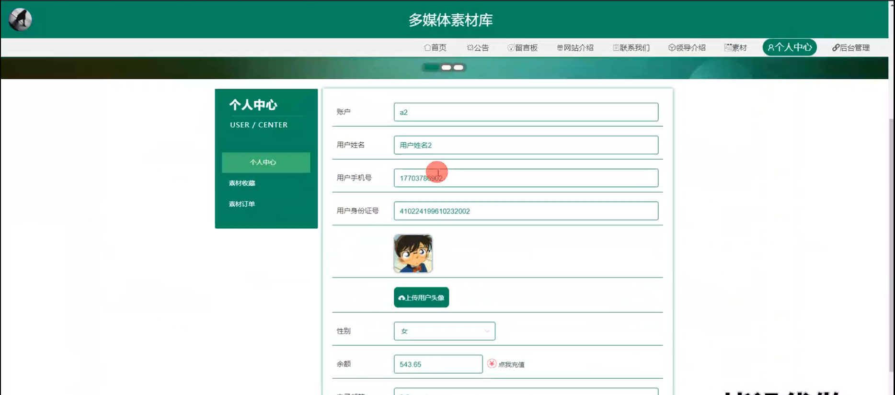
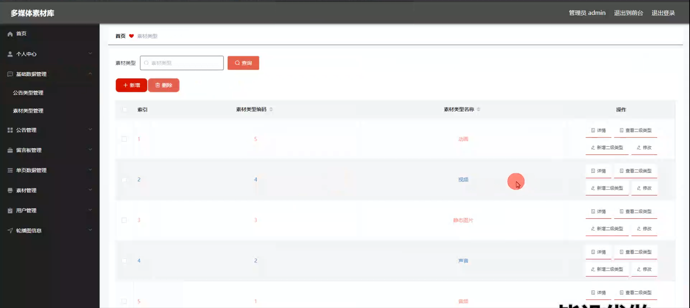
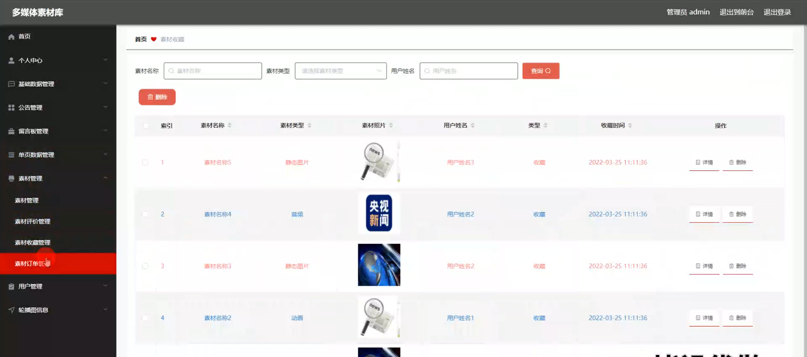
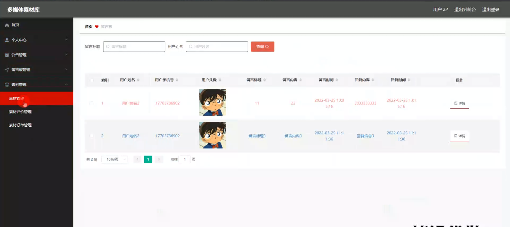

# 毕业设计-基于springboot的多媒体素材库的开发与应用

#### 系统概要

本系统是一个基于SpringBoot框架构建的多媒体素材库管理与应用平台，旨在为用户提供高效、便捷的素材存储与检索服务。系统设计了两种角色——管理员与用户，以实现精细化的权限管理和功能划分。管理员拥有全面的系统控制权限，包括基础数据的维护，用户行为的监控，以及素材的审核与管理。用户则可以浏览、使用素材库中的资源，同时也能上传素材，参与社区互动，如留言、评论等。

#### 研究背景

信息化管理模式是将行业中的工作流程由人工服务，逐渐转换为使用计算机技术的信息化管理服务。这种管理模式发展迅速，使用起来非常简单容易，用户甚至不用掌握相关的专业知识，根据教程指导即可正常使用相关的系统，因而被越来越多的用户所使用。由于相关行业管理信息化，这就使得管理工作不在受到时间和区域的限制，随时随地即可完成相关的工作任务和结果。就目前而言，管理信息化在现代社会中非常流行，使用比较广泛。早在20世纪70年代末，就出现了早期的电子商务，相关的公司企业使用计算机建立专用的内部网络，通过内部网络完成相应的采购、销售等活动，加快相关的企业之间的交易速度，提高了工作效率。
当下，许多行业采用互联网技术将工作流程信息化、数字化，提高了相关人员的服务质量和效率，节约了相关行业的人力、财力、物力等资源，与此同时，人们获取外界的相关信息主要依赖于主流的信息化技术和工具。人们对生活的需求也在不断的发生着变化，为了应对用户的多样化需求，许多相关的第三产业应运而生，管理信息化也逐渐的流行起来，比如电子商务行业。本人通过查询大量学习资料，了解基本的开发系统的基本背景和关键任务，学习与掌握Java语言、web技术、AJAX技术、HTML语言等开发技术，设计系统功能模块，以及MySQL数据库的相关语法和工具，创建和存储数据表格，反映和关联表格之间相互存在的关系，由此对多媒体素材库进行研发和实现。

#### 技术栈

后端技术栈：Springboot+Mysql+Maven

前端技术栈：Vue+Html+Css+Javascript+ElementUI

开发工具：Idea+Vscode+Navicate

#### 系统功能介绍

管理员角色功能模块：  
个人中心：管理员可以在此模块查看和编辑个人资料，包括账户信息和安全设置。  
基础数据管理：负责维护系统的基础信息，如分类、标签等，确保素材库的结构化和标准化。  
公告管理：发布和管理全站公告，及时传达系统更新、使用指南等信息。  
留言板管理：监控和管理用户留言，处理用户反馈，提升用户体验。  
单页数据管理：管理网站的静态页面内容，如关于我们、联系方式等。  
素材管理：审核、分类、标签化管理用户上传的素材，确保素材库的质量和安全性。  
用户管理：监控用户行为，处理违规操作，管理用户账号状态。  
轮播图信息管理：管理首页轮播图，提升网站视觉吸引力和用户体验。  

用户角色功能模块：  
公告：查看系统发布的最新公告，了解系统动态。 
留言板：提交反馈或建议，与管理员互动。  
网站介绍：了解网站背景、目标和特色。  
联系我们：获取网站的联系方式，寻求帮助或合作。  
领导介绍：展示网站或机构的领导团队，增强信任感。  
素材：浏览、搜索素材库，下载或使用素材，上传个人素材。  
个人中心：管理个人账户信息，查看使用记录和收藏。  
后台管理：用户角色下的后台管理功能，包括公告管理、留言板管理、素材管理，允许部分用户参与系统维护，如社区版主。  

#### 系统功能设计

本系统主要通过使用Java语言编码设计系统功能，MySQL数据库管理数据，AJAX技术设计简洁的、友好的网址页面，然后在IDEA开发平台中，编写相关的Java代码文件，接着通过连接语言完成与数据库的搭建工作，再通过平台提供的Tomcat插件完成信息的交互，最后在浏览器中打开系统网址便可使用本系统。本系统的使用角色可以被分为用户和管理员，用户具有注册、查看信息、留言信息等功能，管理员具有修改用户信息，发布新闻等功能

#### 系统作用

本系统通过精细的角色划分和功能模块设计，不仅提升了素材管理的效率，还增强了用户与系统之间的互动性，促进了多媒体素材的高效利用和共享。对于管理员而言，系统提供了全面的管理工具，使得资源的维护和用户行为的监控变得更加高效和便捷。对于用户而言，系统提供了丰富的素材资源和互动平台，满足了他们对多媒体素材的多样化需求，同时也鼓励用户参与到社区建设中，形成良好的社区氛围。

#### 系统功能截图

登录

公告模块

留言板模块

网站介绍

素材模块

个人中心

管理员端后台管理

素材管理

用户端后台管理

#### 总结

多媒体素材库的开发与应用系统，通过采用SpringBoot框架和角色权限管理机制，解决了传统素材库系统存在的问题，提升了素材库的使用体验和管理效率。系统不仅满足了管理员对素材库的精细化管理需求，还为用户提供了丰富的资源和互动平台，促进了多媒体素材的高效利用和共享，具有广泛的应用前景和研究价值。未来，本系统将继续优化和拓展功能，以适应不断变化的用户需求和技术进步。

#### 使用说明

创建数据库，执行数据库脚本 修改jdbc数据库连接参数 下载安装maven依赖jar 启动idea中的springboot项目

前台登录页面
http://localhost:8080/duomeitisucaiku/front/index.html

后台登录页面
http://localhost:8080/duomeitisucaiku/admin/dist/index.html

管理员				账户:admin 		密码：admin

用户				账户:a1 		密码：123456
